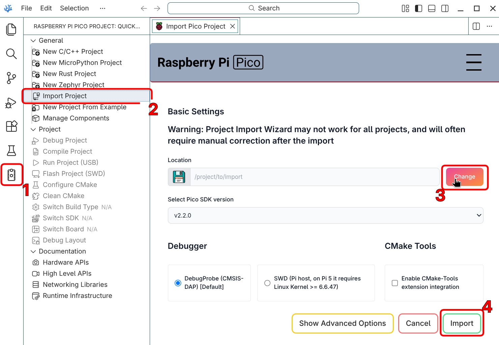

# Current status
Incomplete and broken

# TODO
- [ ] Update the code to support the current "button" library
- [ ] Settings memory - saving into the flash (ideally with rotation of the banks so we're degrading it evenly all around). Loading too
- [ ] Sparking/sensing loop
- [ ] Sensing contact
- [ ] Limit switches

# Features
- [x] Graphical interface with togglable modes
- [x] Menu for performing and configuring:
    - Jogging up/down
    - Burn depth
    - T_on (and displaying the resulting frequency)
    - T_off

# Build instructions
The project is built using VSCodium (or VSCode) with [Raspberry Pi Pico extension](https://open-vsx.org/extension/raspberry-pi/raspberry-pi-pico). I'm developing on Linux, but it should build on Windows just as well.

> ### Pi Pico extension on Linux and Flatpak'd VSCodium
> Couple quirks I had to navigate, leaving breadcrumbs for my future self:
> - installed packages `gcc g++ make cmake gdb binutils tar`
> - added myself to a group that sees COM devices: `sudo usermod -aG dialout $USER`
> - added the exact COM port's device into `Settings > Micropico: Manual Com Device`: `/dev/ttyACM0`
> - reboot/logout for the device to take
> - and because I'm funni with where my projects live, added broad FS permissions to flatpak'd VSCodium: `flatpak override --user com.vscodium.codium --filesystem=/media` (note: not sure if this step is strictly necessary; YOU are unlikely to need it, but maybe it helps you. Or future me)

### Initializing the project
1. open Raspberry Pi Pico extension panel
2. select `Raspberry Pi Pico: Import Project` command (also available from command palette)
3. select a path to the project (repo root)
4. confirm "import" operation



### Adjusting to YOUR Pico
Because ultimately firmware is going to make use of the flash, it seems important to specify the exact board (and thus available flash). In `CMakeLists.txt`, adjust:
```
set(PICO_BOARD pimoroni_picolipo_4mb CACHE STRING "Board type")
```
to whatever board you actually have. You can also do so from the status bar buttons provided by MicroPico extension

### Building
Once the project is initialized (extension might chug for a bit downloading the SDK and whatnot) it's time to:
1. `Raspberry Pi Pico: Configure CMake` (expected: notification "CMake has configured your build.")
2. `Raspberry Pi Pico: Compile Project` (expected: terminal shows up with a ninja process that ends with `Linking CXX executable RavingPixies.elf` and no error codes )

All going well, `build` folder should have a `RavingPixies.uf2` file. Pop your pico into boot mode, flash the precious, enjoy.